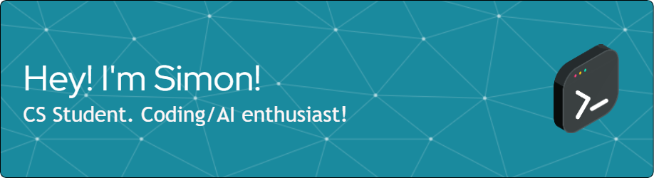

  

## About me :bowtie:

- 👨‍🎓 Studying Computer Science and Intelligent Systems on AGH Kraków.
- 👷 Currently developing **Gerb**.
- 📖 Currently learning Python and its AI-related modules.
- 📞 How to reach me: nizinski.szy@gmail.com
- ✨ Fun fact: I love hitting the gym 🍚🍗 and playing computer games 🎮!

## IT related free time activities 💻

I love (depends on the task, sometimes I hate) doing some leetcode problems:
  

## Tech stack 👨‍💻

I mostly work with Python and its Data/AI related modules. The more aesthetic tech-stack presentation below 😃!

  <table>
    <tr>
      <td align="center" width=110></td>
      <td align="center" width=110></td>
      <td align="center" width=110></td>
      <td align="center" width=110></td>
      <td align="center" width=110></td>
    </tr>
    <tr>
      <td align="center" width=110>Python</td>
      <td align="center" width=110>Pandas</td>
      <td align="center" width=110>NumPy</td>
      <td align="center" width=110>TensorFlow</td>
      <td align="center" width=110>Django</td>
    </tr>
  </table>
  <table>
    <tr>
      <td align="center" width=90></td>
      <td align="center" width=90></td>
      <td align="center" width=90></td>
      <td align="center" width=90></td>
      <td align="center" width=90></td>
      <td align="center" width=90></td>
    </tr>
    <tr>
      <td align="center" width=90>pgSQL</td>
      <td align="center" width=90>MySQL</td>
      <td align="center" width=90>pytest</td>
      <td align="center" width=90>C++</td>
      <td align="center" width=90>C#</td>
      <td align="center" width=90>Excel</td>
    </tr>
  </table>
  <table>
    <tr>
      <td align="center" width=70></td>
      <td align="center" width=70></td>
      <td align="center" width=70></td>
      <td align="center" width=70></td>
      <td align="center" width=70></td>
      <td align="center" width=70></td>
      <td align="center" width=70></td>
      <td align="center" width=70></td>
      <td align="center" width=70></td>
    </tr>
    <tr>
      <td align="center" width=70>Git</td>
      <td align="center" width=70>GitHub</td>
      <td align="center" width=70>GitLab</td>
      <td align="center" width=70>Jupyter</td>
      <td align="center" width=70>VSC</td>
      <td align="center" width=70>Trello</td>
      <td align="center" width=70>Jira</td>
      <td align="center" width=70>Windows</td>
      <td align="center" width=70>Linux</td>
    </tr>
  </table>

